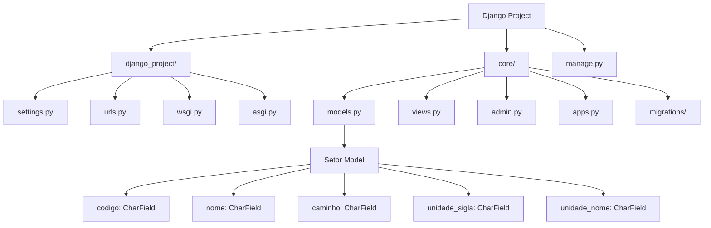
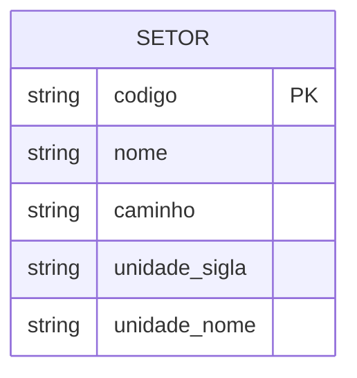
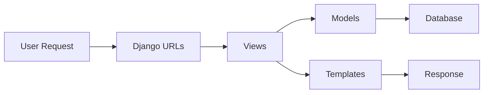

# PROGEP

## Project Structure

```mermaid
graph TD
    A[Django Project] --> B[django_project/]
    A --> C[core/]
    A --> D[manage.py]
    
    B --> E[settings.py]
    B --> F[urls.py]
    B --> G[wsgi.py]
    B --> H[asgi.py]
    
    C --> I[models.py]
    C --> J[views.py]
    C --> K[admin.py]
    C --> L[apps.py]
    C --> M[migrations/]
    
    I --> N[Setor Model]
    N --> O[codigo: CharField]
    N --> P[nome: CharField]
    N --> Q[caminho: CharField]
    N --> R[unidade_sigla: CharField]
    N --> S[unidade_nome: CharField]
```

## Database Model Flow

```mermaid
erDiagram
    SETOR {
        string codigo PK
        string nome
        string caminho
        string unidade_sigla
        string unidade_nome
    }
```

## Application Flow

```mermaid
flowchart LR
    A[User Request] --> B[Django URLs]
    B --> C[Views]
    C --> D[Models]
    D --> E[Database]
    C --> F[Templates]
    F --> G[Response]
```

